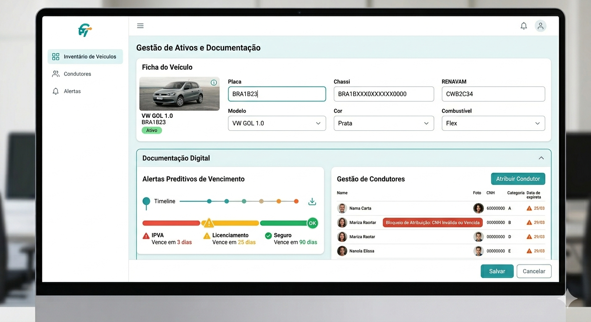
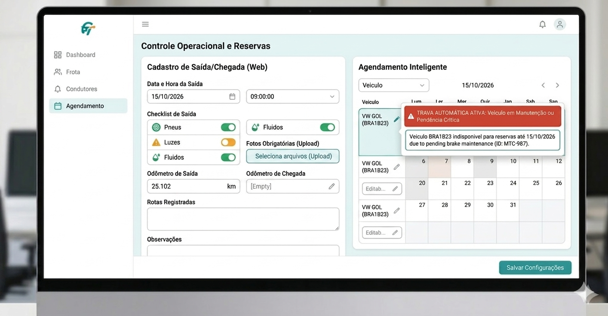
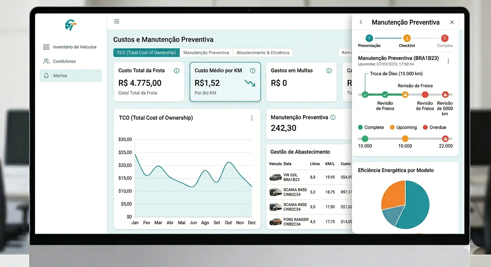
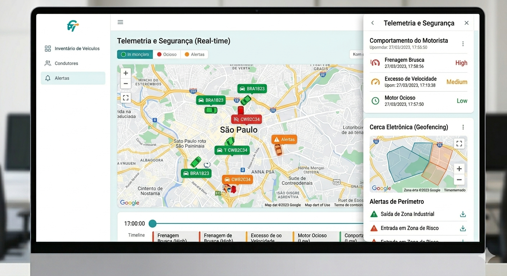
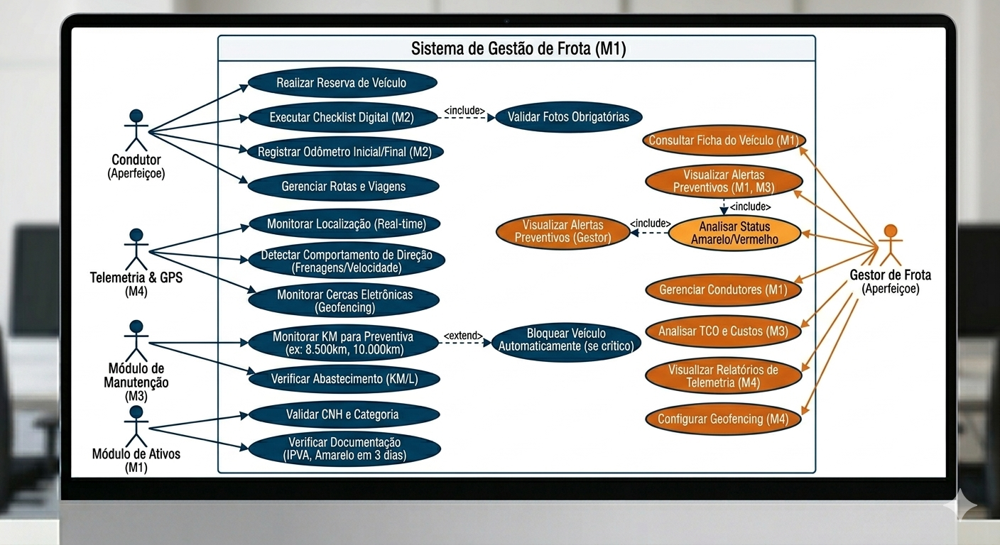
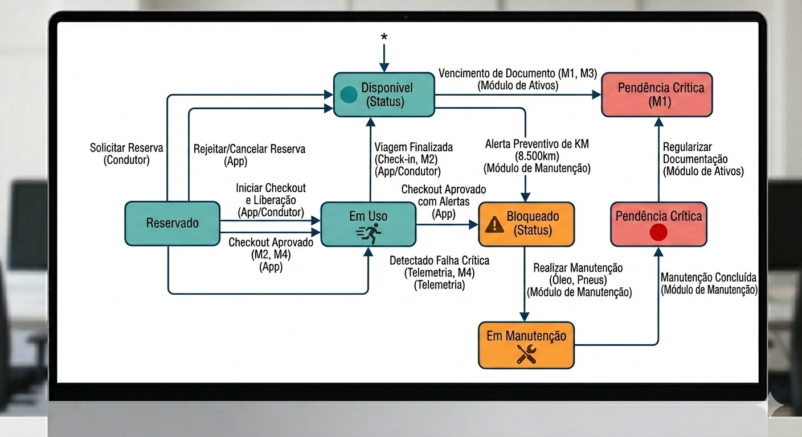
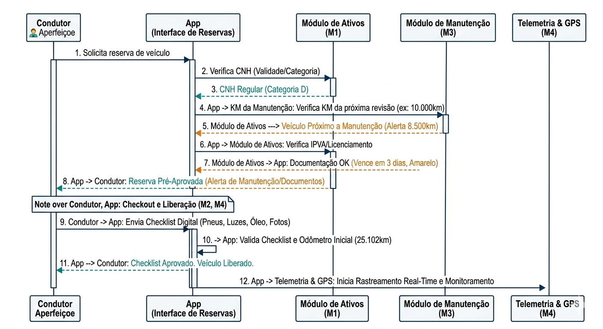

# RPO de Produção

# Gestão de Frota


> Solução robusta para centralização de dados veiculares, conformidade de condutores e monitoramento de telemetria em tempo real.

---

## Módulos

### 1. Gestão de Ativos e Documentação
Centralização técnica e jurídica para evitar multas administrativas.
* **Ficha do Veículo:** Registro detalhado (Placa, Chassi, RENAVAM, Modelo, Cor e Combustível).
* **Documentação Digital:** Alertas preditivos de vencimento para **IPVA, Licenciamento e Seguro**.
* **Gestão de Condutores:** Controle de validade de **CNH** e categorias (A, B, D, E) com bloqueio de atribuição.

### 2. Controle Operacional e Reservas
Garantia de disponibilidade e integridade física da frota.
* **Checklist Digital:** Inspeção obrigatória de segurança (pneus, luzes, fluidos) via app antes de cada saída.
* **Gestão de Rotas:** Registro de odômetro inicial e final para auditoria de distância percorrida.
* **Agendamento Inteligente:** Sistema de reservas com **trava automática** para veículos em manutenção ou com pendências críticas.

### 3. Custos e Manutenção Preventiva
Foco na redução do TCO (*Total Cost of Ownership*).
* **Manutenção Automática:** Alertas baseados em quilometragem (ex: Troca de óleo a cada $10.000$ km).
* **Gestão de Abastecimento:** Monitoramento de eficiência energética ($km/l$) e integração com cartões de combustível.
* **Controle de Infrações:** Registro de multas, indicação automática do condutor e controle de prazos de recurso.

### 4. Telemetria e Segurança (Real-time)
Monitoramento ativo via GPS e sensores de comportamento.
* **Rastreamento:** Localização exata em tempo real e histórico completo de posições.
* **Comportamento do Motorista:** Detecção de frenagens bruscas, excesso de velocidade e motor ocioso (desperdício).
* **Cerca Eletrônica (Geofencing):** Notificações imediatas para saídas de perímetro permitido ou entrada em zonas de risco.

---

## TELAS

### Interface do Sistema

Gestão de Ativos e Documentação

  
*Centralização de dados e alertas de CNH/IPVA*

Controle Operacional


*Checklist digital e travas de agendamento*

Custos e Manutenção 


*Análise de TCO e preventivas*

Telemetria em Tempo Real

 
*Monitoramento GPS e comportamento do condutor*

---

## Diagramas

### Diagramas do Sistema

Diagrama de Casos de Uso

  
*Diagrama de Casos de Uso*

#### 1. Os Atores (Quem participa?)
* **Condutor:** O usuário operacional. Suas ações são focadas no uso do veículo (Reserva,   Checklist, Rotas).

* **Gestor de Frota:** O administrador. Suas ações são de controle, análise financeira (TCO), gestão de pessoas e configuração.

* **Atores de Sistema (Telemetria, Manutenção, Ativos):** Note que eles também são "atores". Isso porque o sistema de GPS ou o banco de dados de manutenção "avisam" o software sobre eventos (ex: excesso de velocidade ou troca de óleo) sem intervenção humana direta.

#### 2. O Limite do Sistema (O Retângulo)
  O retângulo grande rotulado como "Sistema de Gestão de Frota" define o que faz parte do seu software. Tudo o que está dentro dele são funcionalidades que precisam ser desenvolvidas.

#### 3. As Funcionalidades e Relacionamentos
* **Os Relacionamentos <<include>> (Obrigatórios):** Isso significa que uma tarefa depende necessariamente da outra.

* **Executar Checklist ➔ Validar Fotos:** O motorista não consegue finalizar o checklist se não tirar as fotos obrigatórias. Uma ação "chama" a outra.

* **Analisar Status ➔ Visualizar Alertas:** Para o Gestor ver um alerta, o sistema obrigatoriamente tem que ter feito a análise de "Status Amarelo/Vermelho" (ex: IPVA vencendo em 3 dias).

* **O Relacionamento <<extend>> (Opcional/Condicional):** Este é o mais importante para a sua "Trava Automática".

* **Monitorar KM ➔ Bloquear Veículo:** O bloqueio não acontece sempre. Ele é uma "extensão" que só ocorre se uma condição for atendida (ex: o KM passou de 10.000 km).

#### 4. Mapeamento por Módulos (Cores e Siglas)
* **M1 (Gestão de Ativos):** Validar CNH, verificar documentação, gerenciar condutores.

* **M2 (Controle Operacional):** Realizar reserva, checklist digital, odômetro.

* **M3 (Custos e Manutenção):** Analisar TCO, verificar abastecimento, alertas de manutenção.

* **M4 (Telemetria):** Monitorar localização, detectar frenagens, configurar geofencing.

Diagrama de Estado


*Diagrama de Estado*

#### 1. Fluxo de Uso Principal (Estados Verdes)
* **Disponível (Status):** O ponto de partida (marcado com um asterisco). O veículo está pronto para ser utilizado.

* **Reservado:** Ocorre quando um condutor solicita a reserva pelo aplicativo.

* **Transição de retorno:** A reserva pode ser rejeitada ou cancelada, voltando o veículo para o estado Disponível.

* **Em Uso:** O veículo entra neste estado após o checkout e liberação pelo condutor/app.

* **Finalização:** Quando a viagem é encerrada (Check-in), o veículo retorna ao estado Disponível.

#### 2. Bloqueios e Manutenção (Estados Laranjas)
* **Bloqueado (Status):** O veículo é impedido de uso por dois motivos principais:

* **Alerta Preventivo de KM:** Gatilho automático ao atingir 8.500km (Módulo de Manutenção).

* **Checkout com Alertas:** Quando o condutor identifica algo irregular no início da viagem.

* **Em Manutenção:** O veículo transita para este estado para realização de serviços (ex: troca de óleo, pneus).

#### 3. Pendências Críticas (Estados Vermelhos)
* **Pendência Crítica (M1):** O veículo é movido diretamente de Disponível para este estado se houver vencimento de documentos (Módulo de Ativos).

* **Pendência Crítica (Sinalizado com ponto vermelho):** Ocorre em duas situações:

* **Detectado Falha Crítica:** Via telemetria enquanto o veículo está Em Uso.

* **Manutenção Concluída:** Após o serviço, o veículo passa por este estágio de validação de pendência antes de retornar ao fluxo normal.

#### Resumo das Transições de Recuperação
Para que o veículo volte a ficar Disponível, ele deve seguir caminhos de regularização:

* **Regularizar Documentação:** Move o veículo da Pendência Crítica para o estado Disponível.

* **Finalização de Viagem/Check-in:** Retorna o veículo do uso para a disponibilidade.


Diagrama de Sequência



**A reserva e liberação de um veículo:**  Ele demonstra como os diferentes módulos interagem em tempo real e como as validações técnicas e de telemetria são aplicadas:

* **Validações Iniciais:** O processo começa com o Condutor solicitando a reserva ao App. O sistema consulta imediatamente os módulos de Ativos (M1) e Manutenção (M3) para verificar a CNH (Categoria D Regular), a quilometragem para a próxima revisão (ex: 8.500 km) e o status do IPVA/Licenciamento.

* **Alertas e Pré-Aprovação:** Como o IPVA e a manutenção estão próximos (em amarelo), o sistema emite alertas preventivos antes de pré-aprovar a reserva.

* **Checklist e Liberação:** Na fase de checkout, o condutor envia o Checklist Digital com fotos e valida o Odômetro Inicial (ex: 25.102 km).

* **Monitoramento Ativo:** Somente após a liberação do veículo, o sistema envia o comando para o módulo de Telemetria & GPS (M4) iniciar o rastreamento em tempo real.

---

## Requisitos Funcionais (RF)

* **RF01 -** Cadastro de Veículos: O sistema deve permitir o registro completo de veículos (placa, modelo, ano, chassi, tipo de combustível e vencimento do licenciamento).

* **RF02 -** Gestão de Condutores: O sistema deve permitir o cadastro de motoristas, vinculando sua CNH e categoria à validade do documento.

* **RF03 -** Controle de Manutenção: O sistema deve permitir o agendamento de manutenções preventivas e o registro de manutenções corretivas, incluindo custos e peças trocadas.

* **RF04 -** Monitoramento de Telemetria: O sistema deve capturar e exibir em tempo real a localização (GPS), velocidade e consumo de combustível dos veículos.

* **RF05 -** Controle de Abastecimento: O sistema deve registrar cada evento de abastecimento, permitindo o cálculo automático de km/litro.

* **RF06 -** Gestão de Sinistros e Multas: O sistema deve permitir o registro de infrações de trânsito e acidentes, vinculando-os ao condutor responsável.

## Requisitos Não Funcionais (RNF)

* **RNF01 -** Disponibilidade: O sistema deve estar disponível para acesso via web e mobile 24/7, com um tempo de atividade (uptime) de 99,8%.

* **RNF02 -** Desempenho (Latência): O tempo de resposta para a atualização da posição de um veículo no mapa não deve exceder 5 segundos.

* **RNF03 -** Segurança de Dados: O acesso ao sistema deve ser controlado por níveis de permissão (ex: Administrador, Gestor, Motorista) e os dados devem ser transmitidos via protocolo HTTPS.

* **RNF04 -** Escalabilidade: O banco de dados deve ser capaz de suportar o crescimento da frota de 100 para até 10.000 veículos sem perda de performance.

* **RNF05 -** Offline (Mobile): O aplicativo mobile deve permitir o registro de vistorias mesmo sem conexão com a internet, sincronizando os dados assim que o sinal for restabelecido.

* **RNF06 -** Integridade: O sistema deve manter um log (trilha de auditoria) de todas as alterações feitas nos registros de documentos e multas.

---

## User Stories (Cards de História)

### Gestão de Ativos e Documentação

* **US01 – Cadastro de Veículo**

História: Como Gestor de Frota, eu quero cadastrar os detalhes técnicos dos veículos (Placa, Chassi, RENAVAM) para manter um inventário centralizado e organizado.

Critérios de Aceite: Campos obrigatórios validados (ex: Placa no formato Mercosul).

Opção de upload de foto do veículo.

* **US02 –** Alerta de Vencimentos
  
História: Como Gestor de Frota, eu quero receber notificações preditivas sobre o vencimento de IPVA e Seguros para evitar multas administrativas e circulação irregular.

Critérios de Aceite: Configuração de antecedência do alerta (ex: 30, 15 e 5 dias).

Dashboard visual com status "Em dia", "A vencer" e "Vencido".

### Controle Operacional e Reservas
* **US03 –** Checklist Obrigatório

História: Como Motorista, eu quero realizar um checklist digital pelo app antes de iniciar uma rota para garantir que o veículo está em condições seguras de uso.

Critérios de Aceite: Impedir a finalização da reserva se itens críticos (freios/pneus) forem reprovados.

Possibilidade de anexar fotos de avarias encontradas.

* **US04 –** Trava de Segurança em Reservas

História: Como Sistema, quero bloquear automaticamente a reserva de veículos em manutenção para que motoristas não utilizem ativos em estado crítico.

Critérios de Aceite: O veículo deve aparecer como "Indisponível" no calendário de agendamento.

### Custos e Manutenção
* **US05 –** Manutenção por KM

História: Como Gestor de Manutenção, eu quero que o sistema dispare ordens de serviço automáticas baseadas no odômetro para garantir que a troca de óleo e filtros ocorra no prazo correto.

Critérios de Aceite: Integração entre o odômetro registrado e o plano de manutenção preventiva.

* **US06 –** Cálculo de Eficiência (Km/L)

História: Como Analista de Custos, eu quero visualizar a média de consumo por veículo para identificar desperdícios ou necessidade de manutenção corretiva.

Critérios de Aceite: Cálculo automático baseado na diferença de odômetro entre dois abastecimentos.

### Telemetria e Segurança
* **US07 –** Cerca Eletrônica (Geofencing)

História: Como Gestor de Segurança, eu quero delimitar áreas permitidas de circulação para receber alertas imediatos caso um veículo entre em zona de risco ou saia da rota prevista.

Critérios de Aceite: Desenho de polígonos no mapa via interface web.

Notificação push/e-mail em tempo real no momento da violação.

* **US08 – Ranking de Comportamento**

História: Como Gestor de RH/Frota, eu quero monitorar eventos de frenagem brusca e excesso de velocidade para pontuar os motoristas e promover treinamentos de direção defensiva.

Critérios de Aceite: Relatório de "Ranking de Motoristas" baseado na severidade dos alertas de telemetria.

---
## Guia de Configuração

### Pré-requisitos
* **Docker & Docker Compose**
* **Chave de API** (Google Maps ou Mapbox para o dashboard)
* **PostgreSQL 14+**

### Instalação Rápida
```bash
# 1. Clone o repositório
git clone [https://github.com/seu-usuario/gestao-frota.git](https://github.com/seu-usuario/gestao-frota.git)

# 2. Acesse o diretório
cd gestao-frota

# 3. Configure o ambiente
cp .env.example .env

# 4. Suba os containers
docker-compose up -d
